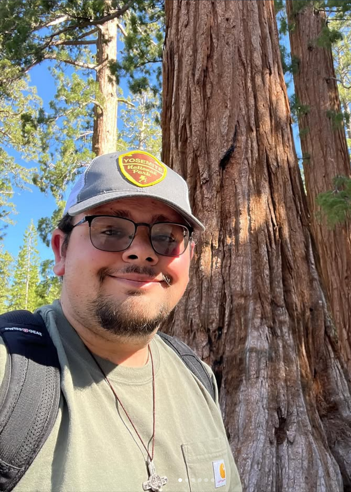

    

## About Me

I am a PhD Student at the University of Gerogia, and a member of the [PMRC Lab.](https://pmrc.uga.edu/) I am studying under both Dr. Bronson Bullock and Dr. Stephen Kinane. My primary focus in on modeling forest systems through statisitcal and machine learning approches. I study biometrics, statistics, ecophysiology, and silviculture.   

### Education

- Bachelors of Science, Forestry (2023) - Mississiipi State University
  - Undergrad Research Advisor: Dr. Adam Polinko
- Masters of Science, Forest Biometrics (2025) - Mississippi State University
  - Advisor: Dr. Krishna Poudel
  - Committiee Members: Dr. Courtney Segiert and Dr. Adam Polinko
  - [Thesis](https://scholarsjunction.msstate.edu/td/6462/)

---

### Talks

**2025 SOMENS**

[Slide Deck](https://github.com/qbocca/qbocca.github.io/blob/main/SOMENS.pdf)

[Markdown and Sources](https://github.com/qbocca/qbocca.github.io/blob/main/DOC.md)
