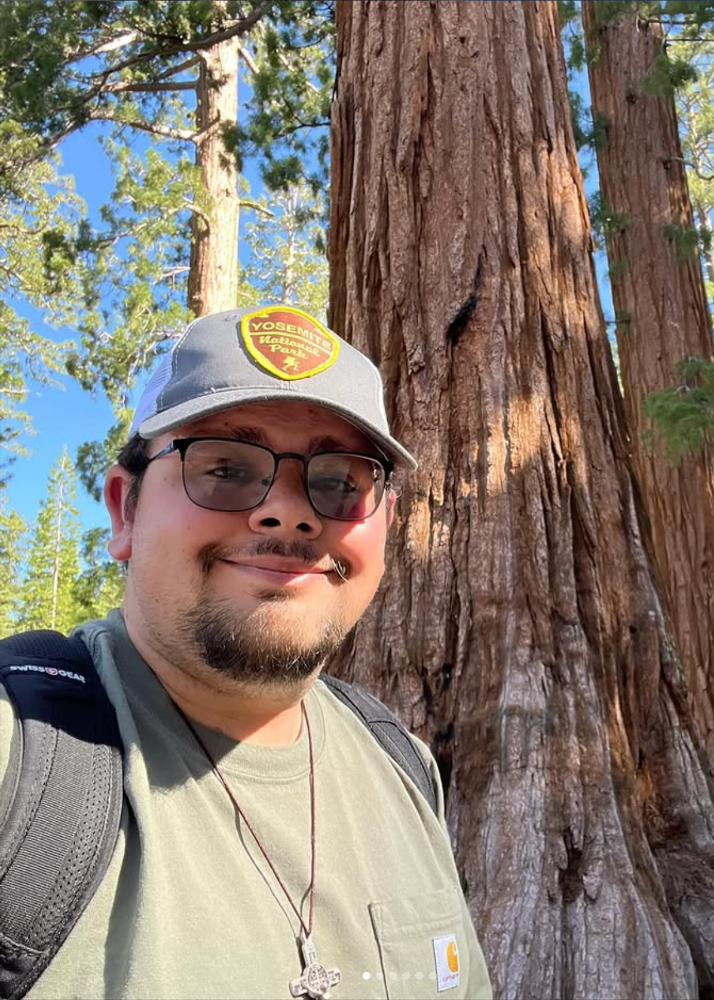

[Home](index.md) [Rambles](/rambles/index.md)

---

    

## About Me

I am a PhD Student at the University of Gerogia, and a member of the [PMRC Lab.](https://pmrc.uga.edu/) I am studying under both Dr. Bronson Bullock and Dr. Stephen Kinane. My primary focus is on modeling forest systems through statisitcal and machine learning approches. I study biometrics, statistics, ecophysiology, and silviculture.   

### Current Projects

1. Mix-species complex stand modeling.
 - Clustering growth and yield across multiple species (Chapter 1, PhD).
3. 3PG landscape level anaylsis.
4. Machine learning classification of site productivity based on "bare" site conditons.

### Education

- Bachelors of Science, Forestry (2023) - Mississiipi State University
  - Undergrad Research Advisor: Dr. Adam Polinko
- Masters of Science, Forest Biometrics (2025) - Mississippi State University
  - Advisor: Dr. Krishna Poudel
  - Committiee Members: Dr. Courtney Segiert and Dr. Adam Polinko
  - [Thesis](https://scholarsjunction.msstate.edu/td/6462/)

### Hobbies and Interests

I am a Christian (Catholic with Anglican Patrimony), and have a strong passion for theology and philosphy. I love camping and being outdoors. I also love using simple and low-tech solutions and having fun side creative side projects that involve coding and experimentation. 

---

### Talks

**PMRC Summer 2026**

<a href="PMRC_2026_Poster_[Boccaleri]_[Quentin].pptx.pdf" target="_blank">Download Poster PDF</a>

[R Shiny App](https://rucvea-quentin-boccaleri.shinyapps.io/shinnyapp/)

**2025 SOMENS**

[Slide Deck](https://github.com/qbocca/qbocca.github.io/blob/main/SOMENS.pdf)

[Markdown and Sources](https://github.com/qbocca/qbocca.github.io/blob/main/DOC.md)

---

### Teaching

**Summer 2026**

UGA Forestry Summer Field Course - TA/Field Instructor

